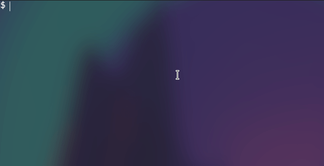

# TIC-TAC-TOE

  

simple tic-tac-toe in terminal, with some extra stuff
like colors and main menu and other things that no one
really needs.

**This project built with**  and ❤️.

## Demo:

## TO-DO:
- [ ] Add continue future, so save the player progress and scores.
- [ ] Add line when the user win cuts the x line or o line.
- [ ] Add dash-board for points.
- [X] Add Colors to this game.
- [ ] Save username to file and save all the scores.
- [ ] Add setting options to the game. 
